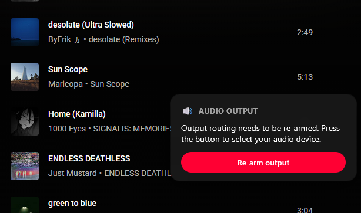
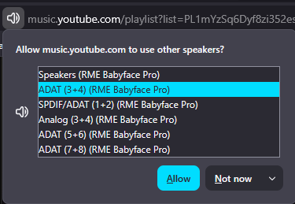
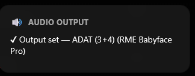

# 🎵 YouTube Music Tab Audio Output Selector

> A Firefox extension that routes YouTube Music audio to a specific output device and keeps it there across song skips and playlist navigation.


---

## Why This Exists

Firefox enforces strict security restrictions that prevent extensions from automatically routing audio output without explicit user interaction. This extension makes that interaction as fast and frictionless as possible — once you pick your device once per browser session, it stays applied silently across all song changes, skips, and playlist navigation.

---

## Features

| Feature | Description |
|---|---|
| 🎧 One-click device pick | Prompts you to select an output device on first play |
| 🖱️ Native browser UI | Uses Firefox's built-in audio output selection dialog |
| 📢 On-screen banner | Large banner appears whenever output selection is required |
| ✔️ Auto-dismiss | Banner disappears once the output device is successfully applied |
| 🔁 Persistent across skips | Audio routing is maintained across song skips and playlist navigation |
| 💾 Device remembered | Selected device is saved to extension storage across reloads |
| 🌐 Scoped | Runs only on `music.youtube.com` |

---

## How It Works

1. **Playback detected** — On first play, the on-screen banner prompts you to pick an audio output device.
2. **Device selection** — Firefox's native audio output selector is invoked via `navigator.mediaDevices.selectAudioOutput()`. This is required once per browser session due to Firefox security policy.
3. **Device applied** — The selected device is routed to the media element via `HTMLMediaElement.setSinkId()`.
4. **Stays applied** — On every song skip or playlist navigation, the extension re-arms the routing silently. Two Firefox-specific quirks are handled:
   - `setSinkId(sameValue)` is treated as a no-op even if routing was internally reset — the extension resets to `""` first then re-applies to force re-initialisation.
   - `setSinkId` called at `HAVE_NOTHING` media state may not actually route audio — the extension defers final confirmation to the `play`/`playing` event.

---

## Screenshots

| Re-arm prompt | Device picker | Success toast |
|:---:|:---:|:---:|
|  |  |  |

---

## Usage

1. Open [YouTube Music](https://music.youtube.com)
2. Click anywhere to start playback (song row, play button, album art, etc.)
3. Choose your desired audio output device from the dialog
4. Audio from the tab will now play through that device — for this browser session

> **After restarting Firefox:** Firefox clears the audio output permission on exit. Simply click to play and re-select your device — takes one click.

---

## Browser Support

| Browser | Supported |
|---|---|
| Firefox | ✅ Yes (fully tested) |
| Chrome / Edge / Other | ⚠️ Untested — depends on API availability |

Support in other browsers requires both `navigator.mediaDevices.selectAudioOutput()` and `HTMLMediaElement.setSinkId()` to be available.

---

## Technical Details

The extension injects a content script at `document_start` on `music.youtube.com`.

**APIs used:**

```js
// Prompt the user to select an audio output device (requires user gesture, once per session)
const device = await navigator.mediaDevices.selectAudioOutput();

// Route the media element to the selected device
await mediaElement.setSinkId(device.deviceId);
```

**Routing strategy:**

- `pendingElements` WeakSet tracks elements where `setSinkId` was called early (at `HAVE_NOTHING` state). These are re-confirmed with a reset+reapply at `play`/`playing` time.
- `armedElements` WeakSet tracks elements confirmed-routed at `play`/`playing` state.
- On `emptied` (src change): both sets are cleared and a 3-second poll begins to catch any new elements.
- On `loadstart`: force-reapply with `setSinkId("") → setSinkId(deviceId)` to bypass Firefox's same-value no-op.

**Permissions required:**

- `storage` — persisting device selection across reloads
- `*://music.youtube.com/*` — content script host permission

---

## Limitations

- Firefox **requires user interaction** before allowing audio output device selection. This cannot be bypassed — it is enforced by browser security policy.
- The permission is **session-scoped**: after restarting Firefox, one click is required to re-select the device. The extension remembers which device you last used and shows the picker pre-selected.

---

## File Structure

```
manifest.json
content_scripts/
    content.js
```

---

## License

[MIT](LICENSE)
